# BMS Point of Sale System

A full-stack Point-of-Sale system built for retail kiosks — Electron desktop app, React/TypeScript frontend, .NET 8 API, and PostgreSQL (Supabase).

---

## Screenshots

### Sign In
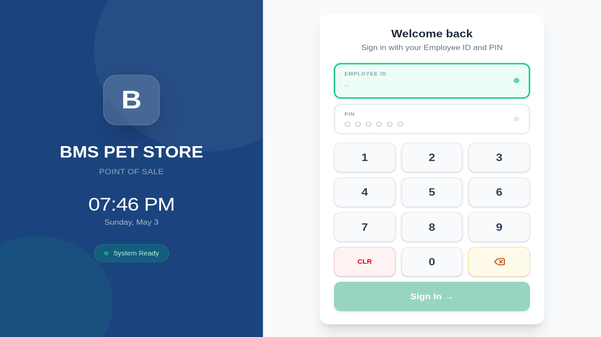
*PIN-based authentication with live clock and system status*

### Manager Dashboard
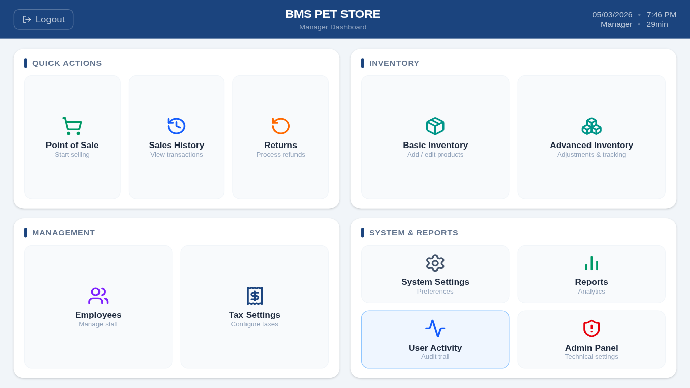
*Quick-action tiles for every workflow — POS, Inventory, Reports, and more*

### Point of Sale
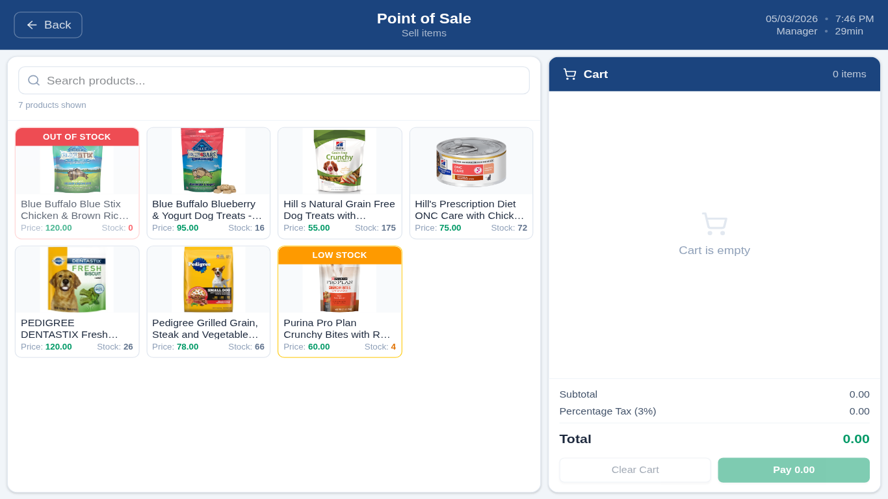
*Product grid with real-time stock badges, barcode search, and cart*

### Employee Management
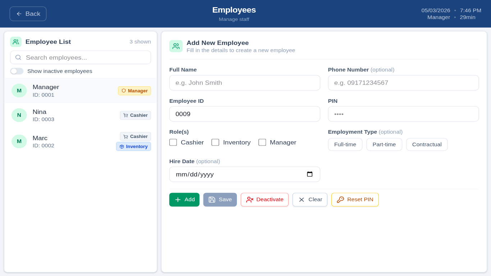
*Add, edit, deactivate, and reset PINs — role badges for Manager / Cashier / Inventory*

### Advanced Inventory
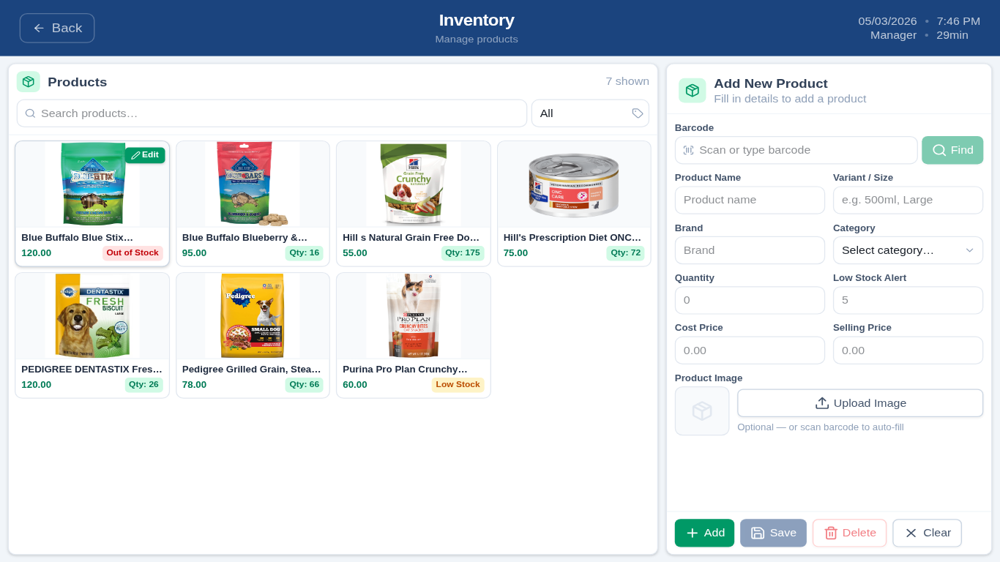
*Stock adjustments, inventory counts, and batch tracking*

### Sales History
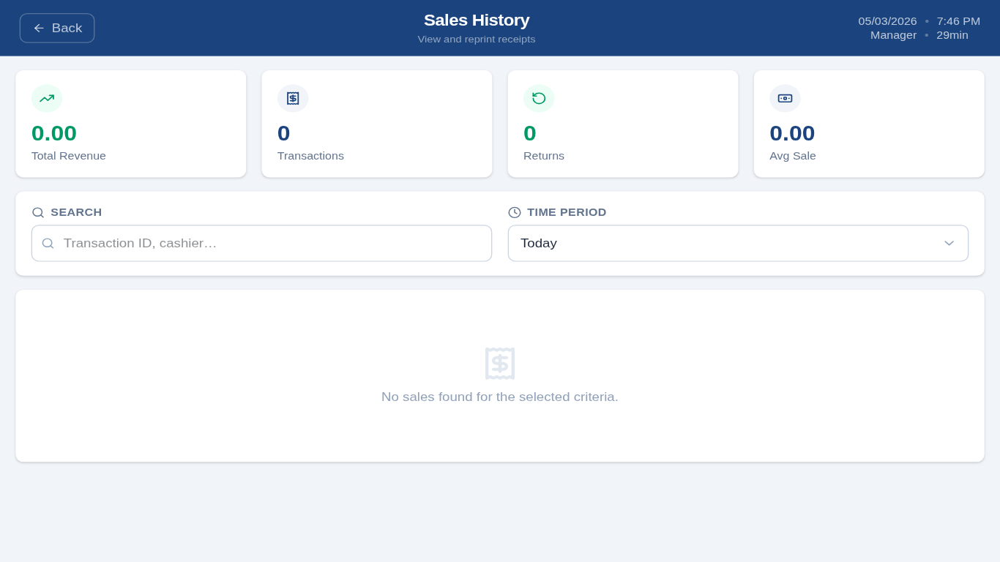
*Full transaction log with search, time-period filter, and receipt reprint*

### Returns & Refunds
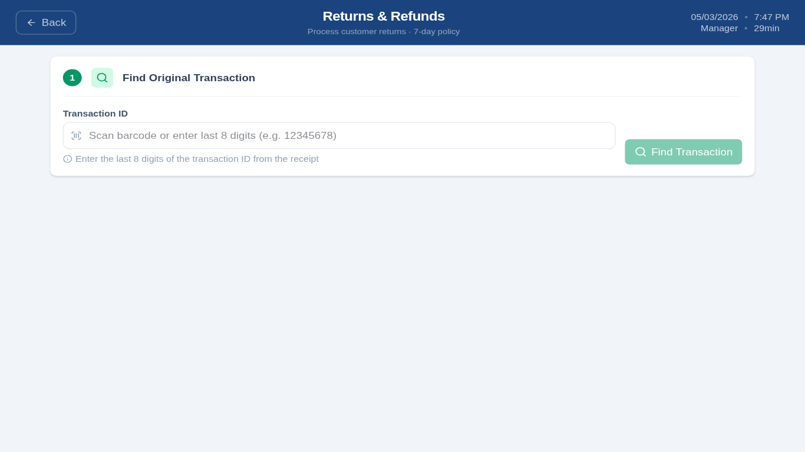
*Process returns by transaction ID with manager-approval workflow*

### Sales Reports
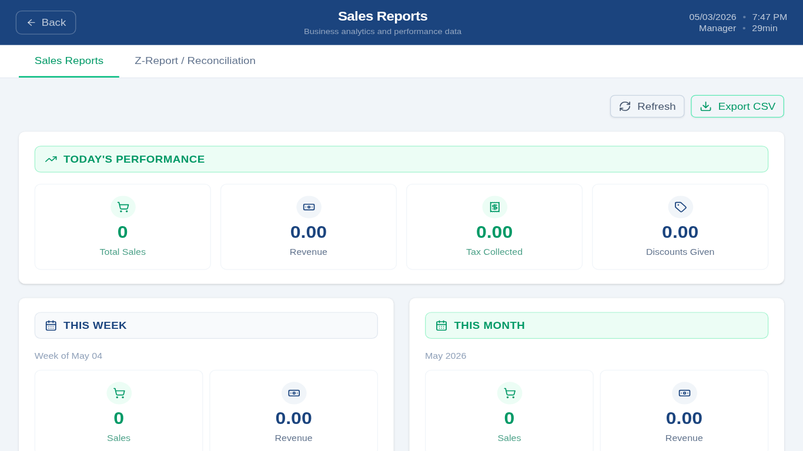
*Today / this week / this month breakdowns — revenue, transactions, tax, discounts*

### Admin Panel
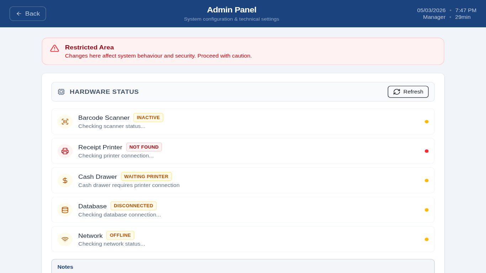
*Hardware status, backup, security settings, and terminal configuration*

### System Settings
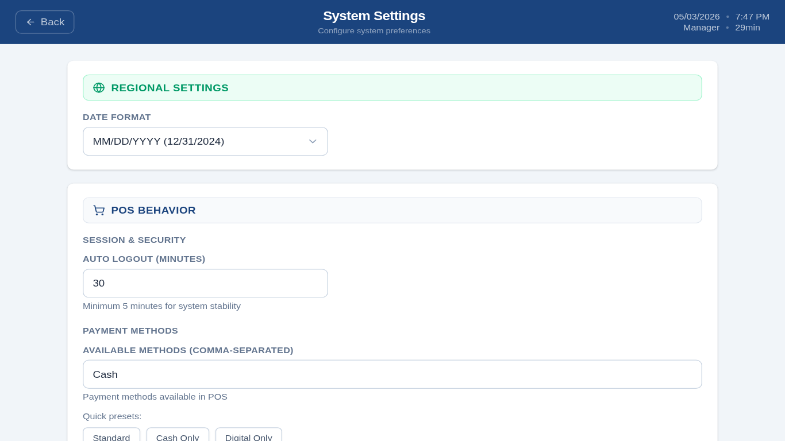
*Date format, auto-logout, payment methods, receipt template*

### Tax Settings
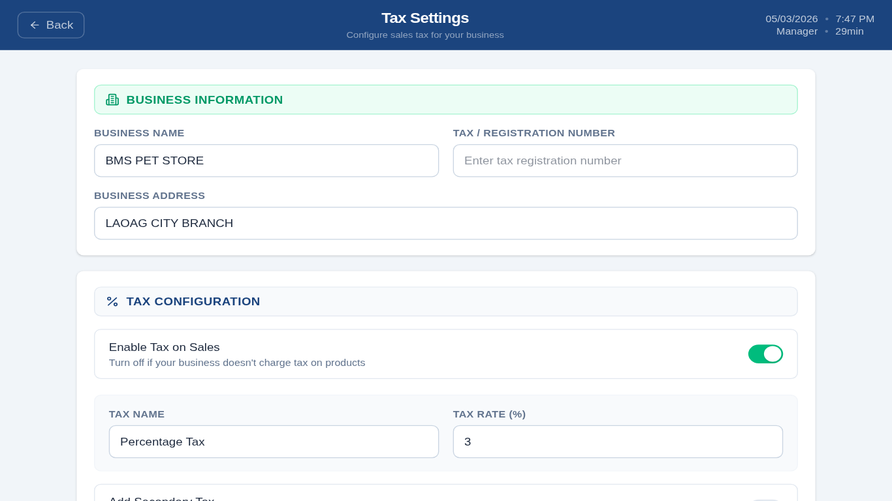
*Business info, primary tax rate, optional secondary tax, exemptions*

### User Activity
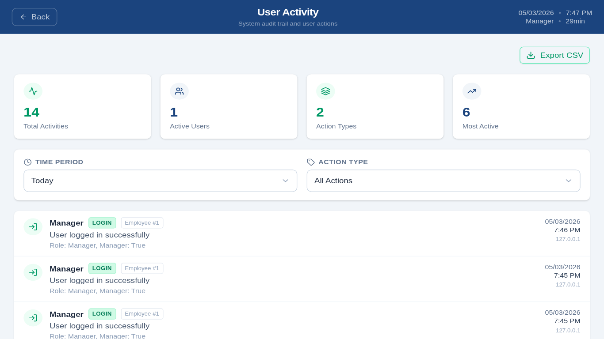
*Complete audit trail — every login, sale, and configuration change*

### Cash Session
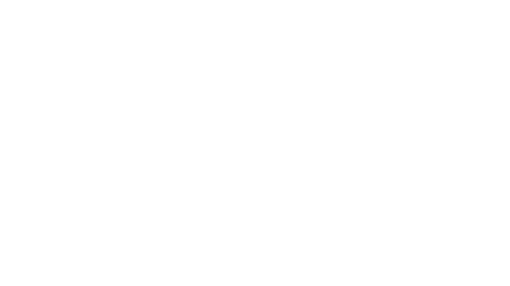
*Open / close cash drawer, variance tracking, Z-Report reconciliation*

### Hardware Status

*Live connectivity for barcode scanner, thermal printer, cash drawer, and database*

---

## Tech Stack

### Frontend
| | |
|---|---|
| **Electron 37.3.0** | Desktop shell, hardware IPC |
| **React 19.1.1 + TypeScript 5.9.2** | UI layer |
| **Vite 7.1.4** | Build tool with hot reload |
| **Tailwind CSS 4.1.12** | Utility-first styling |
| **shadcn/ui + Radix UI** | Accessible component library |
| **React Router 6.30.1** | Hash-based client routing |

### Backend
| | |
|---|---|
| **.NET 8.0 / ASP.NET Core** | REST API |
| **Entity Framework Core 9.0** | ORM with auto-migrations |
| **PostgreSQL via Supabase** | Npgsql 9.0.4 |
| **Serilog 9.0** | Structured JSON logging |
| **BCrypt.Net** | Secure PIN hashing (work factor 12) |
| **JWT Bearer** | Stateless auth with token denylist |

---

## Features

### Core POS
- PIN-based login with role-based access (Manager / Cashier / Inventory)
- Multi-item transactions — tax, discounts, change calculation
- Cash, Card, and Digital payment methods
- Thermal receipt printing (ESC/POS) with customisable templates
- Barcode scanner auto-detection

### Inventory
- Full product CRUD — pricing, stock levels, images
- Batch tracking with lot numbers, expiration dates, supplier info
- Manual stock adjustments with audit trail
- Inventory counts (full, cycle, spot) with variance tracking
- Low-stock alerts with configurable minimums

### Returns & Refunds
- Returns linked to original sale by transaction ID
- Optional manager-approval threshold
- Automatic stock restoration on approved returns

### Reporting
- Daily / weekly / monthly sales summaries
- Top products by quantity and revenue
- Payment method breakdown
- Z-Report / cash reconciliation

### Administration
- Employee management — add, edit, deactivate, reset PIN
- System settings — date format, auto-logout, receipt layout
- Tax settings — primary + optional secondary rate, exemptions
- Full audit log — every action with user, timestamp, and IP
- Hardware status dashboard

### Security
- BCrypt PIN hashing (automatic upgrade from legacy plaintext on first login)
- JWT tokens with per-token denylist (revoked on logout)
- Login lockout after repeated failed attempts (DB-persisted, survives restarts)
- Claims enforcement middleware — headers overwritten with verified JWT claims
- Rate limiting — 10 auth requests / 5 min per IP; 300 global requests / min per IP
- Localhost-only CORS (Electron renderer)
- `X-Terminal-Id` header scopes multi-terminal reporting

---

## Project Structure

```
BMS-Point-of-Sale-System/
├── src/
│   ├── frontend/              # React + TypeScript app
│   │   ├── components/        # 30+ feature components
│   │   ├── contexts/          # Auth, session, connectivity
│   │   ├── utils/             # API client, cache, offline queue
│   │   └── App.tsx            # Routes
│   └── electron/
│       ├── main.js            # Electron main — window, multi-display, hardware
│       ├── preload.js         # IPC bridge (electronAPI)
│       └── ipc/hardware.js    # Printer, scanner, cash drawer detection
│
├── BMS_POS_API/               # .NET 8 REST API
│   ├── Controllers/           # 13 controllers
│   ├── Models/                # EF Core entities
│   ├── Services/              # Business logic
│   ├── Middleware/            # Auth, logging, error handling, security headers
│   ├── Migrations/            # EF Core migrations (auto-applied on startup)
│   └── Program.cs
│
├── BMS_POS_API.Tests/         # Test suite
│   ├── Controllers/           # Unit tests (Moq + InMemory DB)
│   ├── Services/              # Service unit tests
│   ├── Middleware/            # Middleware unit tests
│   ├── Validation/            # Business rule tests
│   └── Integration/
│       ├── ApiIntegrationTests.cs        # In-memory API integration tests
│       └── Postgres/                     # Real-Postgres integration tests (157 tests)
│
├── tests/e2e/                 # Playwright end-to-end tests
├── docs/                      # Documentation and screenshots
├── .github/workflows/ci.yml   # CI: Frontend + Backend Unit + Integration + E2E
├── .env.example               # Environment variable template
└── package.json
```

---

## Installation & Setup

### Prerequisites
- **Node.js 20+**
- **.NET 8.0 SDK**
- **PostgreSQL 13+** or a [Supabase](https://supabase.com) project

### 1. Clone
```bash
git clone https://github.com/decentaro/BMS-Point-of-Sale-System.git
cd BMS-Point-of-Sale-System
```

### 2. Install Dependencies
```bash
npm install
```

### 3. Configure Environment
```bash
cp .env.example .env
```

Edit `.env`:
```bash
BMS_DB_USER=your_postgres_user
BMS_DB_PASSWORD=your_password
BMS_DB_SERVER=your_supabase_host
BMS_DB_PORT=5432
BMS_DB_NAME=postgres
```

### 4. Start Development
```bash
./dev.sh
```

This starts the .NET API (`localhost:5002`), Vite dev server (`localhost:3001`), and the Electron app. Database migrations are applied automatically on first run and a default manager account is created.

### 5. First Login
```
Employee ID: 0001
PIN: 1234
```
You will be prompted to change the PIN on first login.

---

## Available Scripts

```bash
# Development
./dev.sh              # Start everything (recommended)
npm run dev           # Electron + DevTools
npm run dev-vite      # Vite dev server only

# Build & Package
npm run build-react   # Build React app
npm run build         # Package Electron app (AppImage / NSIS / DMG)
npm run build:linux   # Linux ARM64 AppImage (Raspberry Pi)

# Multi-Display
npm run display0      # Primary display
npm run display1      # Secondary display
npm run display2      # Tertiary display

# Testing
npm test                   # Vitest unit tests
npm run test:e2e           # Playwright E2E tests
dotnet test BMS_POS_API.Tests/   # All backend tests
```

---

## API Reference

### Authentication
| Method | Endpoint | Description |
|--------|----------|-------------|
| `POST` | `/api/auth/login` | PIN login — returns JWT |
| `POST` | `/api/auth/logout` | Revoke token |
| `POST` | `/api/auth/validate-manager` | Validate manager PIN for approval flows |

### Employees
| Method | Endpoint | Description |
|--------|----------|-------------|
| `GET` | `/api/employees` | List employees |
| `POST` | `/api/employees` | Create employee |
| `PUT` | `/api/employees/{id}` | Update employee |
| `DELETE` | `/api/employees/{id}` | Deactivate employee |
| `PUT` | `/api/employees/{id}/reset-pin` | Reset PIN |

### Products
| Method | Endpoint | Description |
|--------|----------|-------------|
| `GET` | `/api/products` | List products |
| `GET` | `/api/products/{id}` | Get product |
| `GET` | `/api/products/barcode/{barcode}` | Lookup by barcode |
| `GET` | `/api/products/low-stock` | Low-stock list |
| `POST` | `/api/products` | Create product |
| `PUT` | `/api/products/{id}` | Update product |
| `DELETE` | `/api/products/{id}` | Soft-delete product |

### Sales
| Method | Endpoint | Description |
|--------|----------|-------------|
| `GET` | `/api/sales` | List sales (paginated) |
| `GET` | `/api/sales/today` | Today's summary |
| `GET` | `/api/sales/top-products` | Best sellers |
| `POST` | `/api/sales` | Create sale (idempotent via `X-Idempotency-Key`) |

### Returns
| Method | Endpoint | Description |
|--------|----------|-------------|
| `GET` | `/api/returns` | List returns |
| `GET` | `/api/returns/summary` | Returns summary |
| `GET` | `/api/returns/{id}` | Get return |
| `POST` | `/api/returns` | Process return (manager PIN validated inline) |

### Cash Sessions
| Method | Endpoint | Description |
|--------|----------|-------------|
| `GET` | `/api/cashsessions/today` | Today's session |
| `POST` | `/api/cashsessions` | Open session |
| `PUT` | `/api/cashsessions/{id}/close` | Close session |

### Stock Adjustments
| Method | Endpoint | Description |
|--------|----------|-------------|
| `GET` | `/api/stockadjustments` | List adjustments |
| `POST` | `/api/stockadjustments` | Create adjustment |
| `PUT` | `/api/stockadjustments/{id}/approve` | Approve adjustment |

### Reports
| Method | Endpoint | Description |
|--------|----------|-------------|
| `GET` | `/api/reports/z-report` | Z-Report for a date |
| `GET` | `/api/reports/z-report-range` | Z-Report range summary |

### Settings
| Method | Endpoint | Description |
|--------|----------|-------------|
| `GET/PUT` | `/api/tax-settings` | Tax configuration |
| `GET/PUT` | `/api/system-settings` | System configuration |
| `GET/PUT` | `/api/admin-settings` | Admin configuration |

### Audit & Health
| Method | Endpoint | Description |
|--------|----------|-------------|
| `GET` | `/api/user-activity` | Activity log |
| `GET` | `/health` | API health |
| `GET` | `/health/live` | Liveness probe |
| `GET` | `/health/ready` | Readiness probe |

---

## Testing

The project has four CI test stages:

| Stage | What runs | Count |
|-------|-----------|-------|
| Frontend (Vitest) | Component + unit tests | 1 509 |
| Backend — Unit | Controllers, services, middleware (InMemory DB) | 269 |
| Backend — Integration | Full API against real PostgreSQL (Respawn) | 157 |
| E2E (Playwright) | Full browser flows against live API | 20+ |

```bash
# Run backend unit tests
dotnet test BMS_POS_API.Tests/ --filter "FullyQualifiedName!~Integration.Postgres"

# Run Postgres integration tests (requires DB env vars)
dotnet test BMS_POS_API.Tests/ --filter "FullyQualifiedName~Integration.Postgres"

# Run E2E (requires running API + Vite)
npm run test:e2e
```

---

## Database Schema

| Table | Purpose |
|-------|---------|
| `employees` | User accounts with BCrypt-hashed PINs |
| `products` | Product catalogue |
| `product_batches` | Batch / lot / expiration tracking |
| `sales` / `sale_items` | Transaction records |
| `returns` / `return_items` | Return records |
| `inventory_counts` / `inventory_count_items` | Count sessions |
| `stock_adjustments` | Manual stock corrections |
| `cash_sessions` | Cash drawer open/close records |
| `tax_settings` | Tax rates and business info |
| `system_settings` | System configuration |
| `admin_settings` | Admin preferences |
| `user_activities` | Full audit trail |

---

## Deployment

The app packages to:
- **Linux ARM64 AppImage** — Raspberry Pi 4/5 (`npm run build:linux`)
- **Windows NSIS installer** — x64
- **macOS DMG** — x64 + Apple Silicon

The .NET API is a separate process started by the Electron main process. Credentials are read from environment variables — never hardcoded.

See [`docs/KIOSK_MODE.md`](docs/KIOSK_MODE.md) for kiosk/fullscreen deployment and [`docs/MULTI_DISPLAY_SETUP.md`](docs/MULTI_DISPLAY_SETUP.md) for multi-monitor configuration.

---

## Troubleshooting

**API won't start**
```bash
cat logs/comprehensive-*.json   # Check structured logs
curl http://localhost:5002/health
```

**Database connection errors**
```bash
# Verify env vars are set
echo $BMS_DB_SERVER $BMS_DB_USER

# Run migrations manually
cd BMS_POS_API && dotnet ef database update
```

**Frontend can't reach API**
```bash
curl http://localhost:5002/health/live
# Should return: Healthy
```

---

## License

ISC

## Author

Marc
